# Introduction to KNIME Analytics Platform / Introducción a KNIME Analytics Platform

> **Study guide / Guía de estudio**  
> For absolute beginners following the introductory KNIME course structure.  
> Para principiantes absolutos que siguen la estructura del curso introductorio de KNIME.

---

## Sources used / Fuentes utilizadas

This guide is based mainly on the public course structure of **DataCamp — Introduction to KNIME** and the official **KNIME Analytics Platform documentation**.  
Esta guía se basa principalmente en la estructura pública del curso **DataCamp — Introduction to KNIME** y en la documentación oficial de **KNIME Analytics Platform**.

- DataCamp — *Introduction to KNIME*: https://www.datacamp.com/courses/introduction-to-knime
- KNIME Analytics Platform Documentation: https://docs.knime.com/ap/latest/
- KNIME Analytics Platform User Guide: https://docs.knime.com/ap/latest/analytics_platform_user_guide/
- KNIME File Handling Guide: https://docs.knime.com/ap/latest/analytics_platform_file_handling_guide/
- KNIME Database Extension Guide: https://docs.knime.com/ap/latest/db_extension_guide/
- KNIME Learning Center: https://www.knime.com/learning

---

## How to use this guide / Cómo usar esta guía

This document is not meant to replace the course. It is meant to help you understand what is happening while you complete each lesson. Read each section before or after the corresponding course chapter, and use the diagrams as mental maps of the workflow logic.

Este documento no busca reemplazar el curso. Busca ayudarte a entender qué está pasando mientras completas cada lección. Lee cada sección antes o después del capítulo correspondiente del curso, y usa los diagramas como mapas mentales de la lógica del workflow.

---

## Table of contents / Tabla de contenidos

1. [First steps into KNIME Analytics Platform / Primeros pasos en KNIME Analytics Platform](#1-first-steps-into-knime-analytics-platform)
   - 1.1 What is KNIME? / ¿Qué es KNIME?
   - 1.2 The workflow / El workflow
   - 1.3 Nodes / Nodos
   - 1.4 Node states / Estados de los nodos
   - 1.5 Node ports / Puertos de los nodos
   - 1.6 The KNIME interface / La interfaz de KNIME
   - 1.7 First mental model / Primer modelo mental
   - 1.8 Example: reading HR data / Ejemplo: leer datos de HR
2. [Data Access / Acceso a datos](#2-data-access)
3. [Data Cleaning / Limpieza de datos](#3-data-cleaning)
4. [Data Analysis / Análisis de datos](#4-data-analysis)
5. [Practical mini-case / Mini caso práctico](#5-practical-mini-case)
6. [Beginner mistakes / Errores comunes de principiantes](#6-beginner-mistakes)
7. [Final summary / Resumen final](#7-final-summary)
8. [Quick reference / Referencia rápida](#8-quick-reference)
9. [What to learn next / Qué aprender después](#9-what-to-learn-next)

---

## Course map / Mapa del curso

The course follows a natural data analysis sequence: first you learn the tool, then you access data, then you clean it, and finally you analyze it.

El curso sigue una secuencia natural de análisis de datos: primero aprendes la herramienta, luego accedes a los datos, después los limpias y finalmente los analizas.

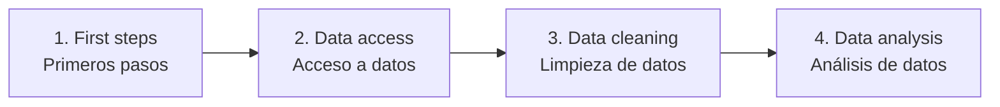

---

# 1. First steps into KNIME Analytics Platform / Primeros pasos en KNIME Analytics Platform

## 1.1 What is KNIME? / ¿Qué es KNIME?

KNIME Analytics Platform is a visual workflow tool for data work. Instead of writing every step as code, you build an analysis by connecting nodes. Each node performs one specific task, such as reading a file, filtering rows, cleaning text, joining tables, calculating metrics, or creating a chart.

KNIME Analytics Platform es una herramienta visual para trabajar con datos. En lugar de escribir cada paso como código, construyes un análisis conectando nodos. Cada nodo realiza una tarea específica, como leer un archivo, filtrar filas, limpiar texto, unir tablas, calcular métricas o crear un gráfico.

A simple KNIME workflow usually looks like this:

Un workflow simple de KNIME normalmente se ve así:

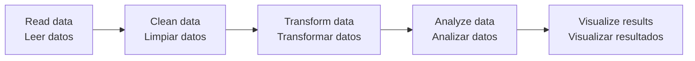

The important idea is that KNIME makes the data pipeline visible. You can see where the data enters, how it changes, and where the final result is produced.

La idea importante es que KNIME hace visible el pipeline de datos. Puedes ver dónde entran los datos, cómo cambian y dónde se produce el resultado final.

---

## 1.2 The workflow / El workflow

A workflow is the complete sequence of steps used to solve a data problem. In KNIME, a workflow is built by placing nodes on the canvas and connecting them from left to right.

Un workflow es la secuencia completa de pasos que se usa para resolver un problema de datos. En KNIME, un workflow se construye ubicando nodos en el lienzo y conectándolos de izquierda a derecha.

Example:

Ejemplo:

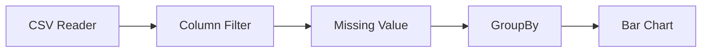

In this example, the data is first read from a CSV file. Then unnecessary columns are removed. Then missing values are handled. After that, the data is aggregated. Finally, the result is visualized in a bar chart.

En este ejemplo, primero se leen los datos desde un archivo CSV. Luego se eliminan columnas innecesarias. Después se tratan los valores faltantes. Luego se agregan los datos. Finalmente, el resultado se visualiza en un gráfico de barras.

---

## 1.3 Nodes / Nodos

A node is the basic building block of KNIME. You can think of a node as a small tool that does one job. Good workflows are built by combining many simple nodes, not by trying to do everything in one place.

Un nodo es la unidad básica de KNIME. Puedes pensar en un nodo como una pequeña herramienta que hace una sola tarea. Los buenos workflows se construyen combinando muchos nodos simples, no intentando hacer todo en un solo lugar.

Typical beginner nodes:

Nodos típicos para principiantes:

| Purpose / Propósito | Node / Nodo | Typical use / Uso típico |
|---|---|---|
| Read data / Leer datos | `CSV Reader` | Load a CSV file / Cargar un archivo CSV |
| Read data / Leer datos | `Excel Reader` | Load an Excel file / Cargar un archivo Excel |
| Select columns / Seleccionar columnas | `Column Filter` | Keep or remove columns / Mantener o eliminar columnas |
| Select rows / Seleccionar filas | `Row Filter` | Keep only rows that match a condition / Mantener solo filas que cumplen una condición |
| Handle missing values / Tratar faltantes | `Missing Value` | Replace or manage null values / Reemplazar o gestionar nulos |
| Aggregate / Agregar | `GroupBy` | Calculate counts, sums, averages / Calcular conteos, sumas, promedios |
| Join data / Unir datos | `Joiner` | Combine two tables / Combinar dos tablas |
| Visualize / Visualizar | `Bar Chart` | Compare categories / Comparar categorías |

---

## 1.4 Node states / Estados de los nodos

Every node in KNIME shows a colored status indicator below it. This is one of the first things a beginner needs to learn, because it tells you exactly what state the node is in and whether something is wrong.

Cada nodo en KNIME muestra un indicador de estado con color debajo de él. Esto es una de las primeras cosas que un principiante necesita aprender, porque indica exactamente en qué estado está el nodo y si algo está mal.

| State / Estado | Color / Color | Meaning / Significado |
|---|---|---|
| Not configured / Sin configurar | Grey / Gris | The node has not been set up yet. Double-click to open its settings. / El nodo aún no ha sido configurado. Haz doble clic para abrir su configuración. |
| Configured / Configurado | Yellow / Amarillo | The node is configured but has not run yet. / El nodo está configurado pero aún no se ha ejecutado. |
| Executed / Ejecutado | Green / Verde | The node ran successfully and its output is available. / El nodo se ejecutó con éxito y su salida está disponible. |
| Error / Error | Red / Rojo | The node failed. Right-click and select "Open node message" to read why. / El nodo falló. Haz clic derecho y selecciona "Open node message" para leer el motivo. |

Key interactions:
- **Double-click**: opens the node configuration dialog.
- **F7** or right-click → Execute: runs the node.
- Right-click → **Open first out-port view**: inspects the output table.

Interacciones clave:
- **Doble clic**: abre el diálogo de configuración del nodo.
- **F7** o clic derecho → Execute: ejecuta el nodo.
- Clic derecho → **Open first out-port view**: inspecciona la tabla de salida.

> **Tip**: After executing a node, always inspect its output by right-clicking and opening the port view. Do not assume it produced what you expected.
>
> **Tip**: Después de ejecutar un nodo, siempre inspecciona su salida haciendo clic derecho y abriendo la vista del puerto. No asumas que produjo lo que esperabas.

---

## 1.5 Node ports / Puertos de los nodos

Nodes have input ports on the left and output ports on the right. The port color indicates what type of data flows through it.

Los nodos tienen puertos de entrada a la izquierda y puertos de salida a la derecha. El color del puerto indica qué tipo de dato fluye por él.

| Port color / Color del puerto | Type / Tipo | Example / Ejemplo |
|---|---|---|
| Grey triangle / Triángulo gris | Data table / Tabla de datos | Output of `CSV Reader` |
| Blue circle / Círculo azul | Model / Modelo | Output of a machine learning node |
| Dark grey / Gris oscuro | Database connection / Conexión de base de datos | Output of `DB Connector` |
| Red / Rojo | Report / Reporte | Output of a reporting node |

For beginners, almost all connections will be grey triangles (data tables). If you try to connect two ports of incompatible types, KNIME will not allow the connection.

Para principiantes, casi todas las conexiones serán triángulos grises (tablas de datos). Si intentas conectar dos puertos de tipos incompatibles, KNIME no permitirá la conexión.

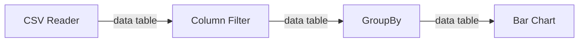

---

## 1.6 The KNIME interface / La interfaz de KNIME  

When you open KNIME, the interface may look complex at first. For a beginner, you only need to focus on four main areas: the workflow editor, the node repository, the node monitor, and the space explorer.

Cuando abres KNIME, la interfaz puede parecer compleja al inicio. Para un principiante, solo necesitas enfocarte en cuatro áreas principales: el editor de workflows, el repositorio de nodos, el monitor de nodos y el explorador de espacios.

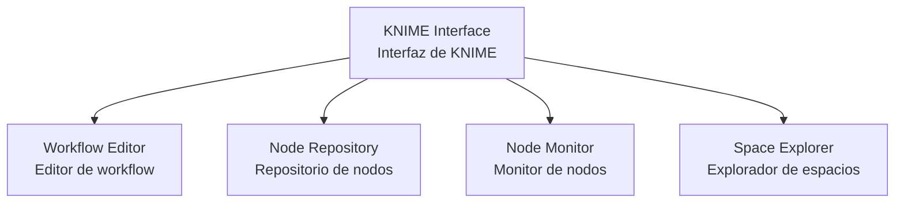

The workflow editor is where you build the workflow. The node repository is where you search for nodes. The node monitor lets you inspect outputs and execution results. The space explorer helps you manage workflows and files in your workspace.

El editor de workflows es donde construyes el flujo. El repositorio de nodos es donde buscas nodos. El monitor de nodos permite inspeccionar salidas y resultados de ejecución. El explorador de espacios ayuda a gestionar workflows y archivos dentro del workspace.

---

## 1.7 First mental model / Primer modelo mental

At the beginning, do not think of KNIME as a replacement for Python, R, SQL, or Excel. Think of KNIME as a visual pipeline builder. It allows you to organize a data process step by step and make each transformation visible.

Al inicio, no pienses en KNIME como un reemplazo de Python, R, SQL o Excel. Piensa en KNIME como un constructor visual de pipelines. Permite organizar un proceso de datos paso a paso y hacer visible cada transformación.

A useful mental model is:

Un modelo mental útil es:

```text
Input table → Operation → Output table
Tabla de entrada → Operación → Tabla de salida
```

Most nodes receive a table, apply a transformation, and return a new table.

La mayoría de los nodos reciben una tabla, aplican una transformación y devuelven una nueva tabla.

---

## 1.8 Example: reading HR data / Ejemplo: leer datos de HR

Suppose the HR department gives you a file with employee information. The first step is not to analyze it immediately. The first step is to read it correctly and inspect its structure.

Supón que el área de HR te entrega un archivo con información de empleados. El primer paso no es analizarlo de inmediato. El primer paso es leerlo correctamente e inspeccionar su estructura.

Typical questions after reading a file:

Preguntas típicas después de leer un archivo:

- How many rows does the file have? / ¿Cuántas filas tiene el archivo?
- What columns are available? / ¿Qué columnas hay disponibles?
- Are the data types correct? / ¿Los tipos de datos son correctos?
- Are there missing values? / ¿Hay valores faltantes?
- Are there columns that are not useful? / ¿Hay columnas que no son útiles?

A beginner workflow for this part could be:

Un workflow inicial para esta parte podría ser:

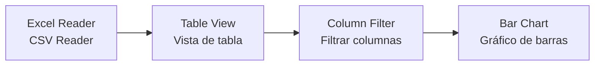

---

# 2. Data Access / Acceso a datos

## 2.1 Why data access matters / Por qué importa el acceso a datos

Data access is the first real step of any analysis. If the data is loaded incorrectly, everything after that may be wrong. A chart can look professional and still be useless if the input data was misunderstood.

El acceso a datos es el primer paso real de cualquier análisis. Si los datos se cargan mal, todo lo que venga después puede estar mal. Un gráfico puede verse profesional y aun así ser inútil si los datos de entrada fueron mal interpretados.

Before cleaning or analyzing data, always inspect the source.

Antes de limpiar o analizar datos, siempre inspecciona la fuente.

---

## 2.2 Local files / Archivos locales

A local file is stored on your computer. Common examples are CSV and Excel files. In KNIME, you usually read them with reader nodes.

Un archivo local está almacenado en tu computador. Ejemplos comunes son archivos CSV y Excel. En KNIME, normalmente se leen con nodos tipo reader.

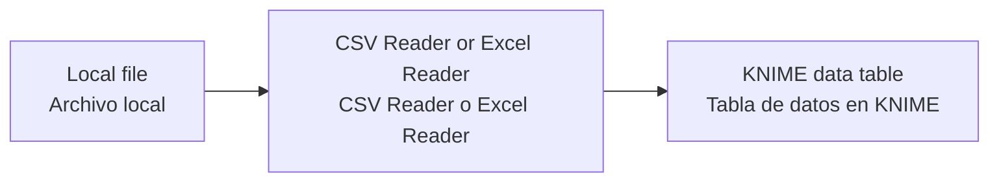

When reading a file, pay attention to separators, decimal symbols, headers, sheet names, and data types.

Al leer un archivo, presta atención a separadores, símbolos decimales, encabezados, nombres de hojas y tipos de datos.

---

## 2.3 File paths / Rutas de archivos

A path tells KNIME where a file is located. Paths can be absolute or relative. An absolute path points to one specific location. A relative path depends on the workflow or workspace location.

Una ruta le indica a KNIME dónde está ubicado un archivo. Las rutas pueden ser absolutas o relativas. Una ruta absoluta apunta a una ubicación específica. Una ruta relativa depende de la ubicación del workflow o del workspace.

Example of an absolute path:

Ejemplo de ruta absoluta:

```text
C:/Users/user/Documents/hr/employees.csv
```

Example of a relative path:

Ejemplo de ruta relativa:

```text
data/employees.csv
```

Relative paths are usually better when you want to share workflows, because the workflow is less dependent on your personal computer structure.

Las rutas relativas suelen ser mejores cuando quieres compartir workflows, porque el workflow depende menos de la estructura específica de tu computador.

---

## 2.4 Reading many files / Leer muchos archivos

In real work, data often comes in multiple files. For example, HR may send one file per month. Instead of manually loading every file, KNIME can help you build a repeatable process.

En el trabajo real, los datos muchas veces vienen en múltiples archivos. Por ejemplo, HR puede enviar un archivo por mes. En lugar de cargar cada archivo manualmente, KNIME puede ayudarte a construir un proceso repetible.

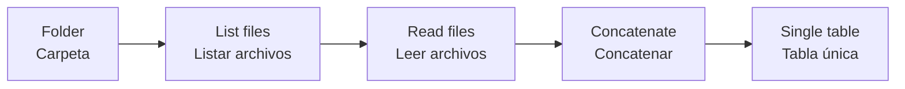

This idea is important because it moves you from manual analysis to automation.

Esta idea es importante porque te lleva del análisis manual a la automatización.

---

## 2.5 Database access / Acceso a bases de datos

KNIME can connect to databases using database connector nodes. Once connected, you can select tables, filter rows, join tables, and aggregate data visually.

KNIME puede conectarse a bases de datos usando nodos conectores. Una vez conectado, puedes seleccionar tablas, filtrar filas, unir tablas y agregar datos de forma visual.

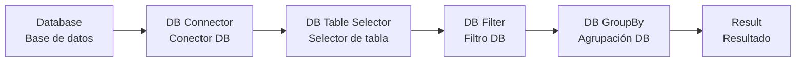

The key beginner idea is that database nodes allow you to work close to the source. In many cases, this is more efficient than downloading a large table and processing everything locally.

La idea clave para principiantes es que los nodos de base de datos permiten trabajar cerca de la fuente. En muchos casos, esto es más eficiente que descargar una tabla grande y procesarlo todo localmente.

---

## 2.6 Data access checklist / Lista de chequeo de acceso a datos

Use this checklist every time you load data.

Usa esta lista cada vez que cargues datos.

- Did the file load without errors? / ¿El archivo cargó sin errores?
- Are the column names correct? / ¿Los nombres de columnas son correctos?
- Are the data types correct? / ¿Los tipos de datos son correctos?
- Are numeric columns recognized as numeric? / ¿Las columnas numéricas quedaron como numéricas?
- Are date columns recognized as dates? / ¿Las columnas de fecha quedaron como fechas?
- Are there unexpected missing values? / ¿Hay valores faltantes inesperados?
- Does the number of rows make sense? / ¿El número de filas tiene sentido?

---

# 3. Data Cleaning / Limpieza de datos

## 3.1 Why data cleaning is necessary / Por qué es necesaria la limpieza de datos

Real data is rarely ready for analysis. It may contain missing values, duplicated records, inconsistent text, wrong data types, unnecessary columns, or strange symbols.

Los datos reales rara vez están listos para análisis. Pueden contener valores faltantes, registros duplicados, texto inconsistente, tipos de dato incorrectos, columnas innecesarias o símbolos extraños.

A clean dataset is not a perfect dataset. It is a dataset that is consistent enough to answer the analysis question.

Un dataset limpio no es un dataset perfecto. Es un dataset suficientemente consistente para responder la pregunta de análisis.

---

## 3.2 Filtering columns / Filtrar columnas

Column filtering means deciding which variables are useful and which ones should be removed. This reduces noise and makes the workflow easier to understand.

Filtrar columnas significa decidir qué variables son útiles y cuáles deberían eliminarse. Esto reduce ruido y hace que el workflow sea más fácil de entender.

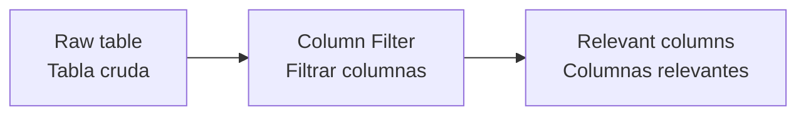

Example:

Ejemplo:

| employee_id | name | department | salary | temporary_note |
|---|---|---|---:|---|
| 1 | Ana | Finance | 4500 | check |
| 2 | Luis | IT | 5200 | old |

If `temporary_note` is not needed, remove it early.

Si `temporary_note` no se necesita, elimínala al inicio.

---

## 3.3 Filtering rows / Filtrar filas

Row filtering means keeping only the records that matter for the analysis. For example, you may want only active employees, only records from 2024, or only one country.

Filtrar filas significa mantener solo los registros que importan para el análisis. Por ejemplo, puedes querer solo empleados activos, solo registros de 2024 o solo un país.

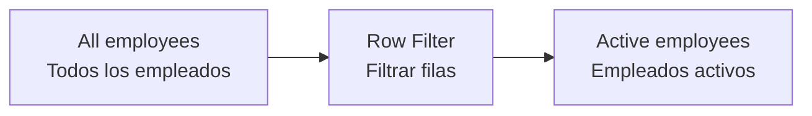

Filtering rows should be done carefully. If you filter too aggressively, you may remove useful information.

El filtrado de filas debe hacerse con cuidado. Si filtras demasiado agresivamente, puedes eliminar información útil.

---

## 3.4 Missing values / Valores faltantes

A missing value means that the data is absent or unknown. Missing values are common, but they need to be handled intentionally.

Un valor faltante significa que el dato está ausente o es desconocido. Los valores faltantes son comunes, pero deben tratarse de forma intencional.

Common strategies:

Estrategias comunes:

| Strategy / Estrategia | When to use it / Cuándo usarla |
|---|---|
| Remove rows / Eliminar filas | When there are very few missing records / Cuando hay muy pocos registros faltantes |
| Replace with constant / Reemplazar con constante | When missing has a specific meaning / Cuando el faltante tiene un significado específico |
| Replace with mean / Reemplazar con media | For simple numeric imputation / Para imputación numérica simple |
| Replace with median / Reemplazar con mediana | When numeric data has outliers / Cuando los datos numéricos tienen atípicos |
| Keep as missing / Mantener como faltante | When absence of data is informative / Cuando la ausencia del dato es informativa |

Example:

Ejemplo:

| employee_id | department | salary |
|---:|---|---:|
| 1 | HR | 4200 |
| 2 | IT | 5600 |
| 3 | Finance |  |

Before replacing a missing salary, ask whether the value is truly unknown, confidential, not applicable, or caused by an error.

Antes de reemplazar un salario faltante, pregunta si el valor realmente es desconocido, confidencial, no aplicable o causado por un error.

---

## 3.5 Cleaning strings / Limpiar texto

Text data often looks clean when viewed quickly, but small differences can create wrong categories.

Los datos de texto muchas veces parecen limpios al mirarlos rápido, pero pequeñas diferencias pueden crear categorías incorrectas.

Example:

Ejemplo:

| Original value / Valor original | Problem / Problema |
|---|---|
| `Bogotá` | Accent variation / Variación de acento |
| `BOGOTA` | Uppercase / Mayúsculas |
| ` bogota ` | Extra spaces / Espacios extra |
| `Bogota.` | Punctuation / Puntuación |

A useful cleaning sequence is:

Una secuencia útil de limpieza es:

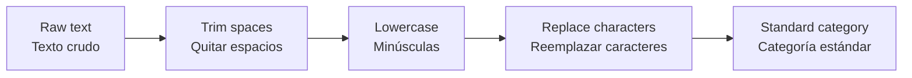

After cleaning, similar values should collapse into one consistent category.

Después de limpiar, valores similares deberían quedar consolidados en una categoría consistente.

---

## 3.6 Data type conversion / Conversión de tipos de dato

A column may look numeric but actually be stored as text. This matters because KNIME cannot calculate an average over a text column.

Una columna puede verse numérica pero estar almacenada como texto. Esto importa porque KNIME no puede calcular un promedio sobre una columna de texto.

Examples:

Ejemplos:

| Value / Valor | Wrong type / Tipo incorrecto | Correct type / Tipo correcto |
|---|---|---|
| `4500` | String | Number |
| `2024-01-15` | String | Date |
| `true` | String | Boolean |

Always check data types after reading a file.

Siempre revisa los tipos de dato después de leer un archivo.

---

## 3.7 Duplicates / Duplicados

A duplicate is a repeated record. Duplicates can inflate counts, distort averages, and create wrong conclusions.

Un duplicado es un registro repetido. Los duplicados pueden inflar conteos, distorsionar promedios y generar conclusiones equivocadas.

Example:

Ejemplo:

| employee_id | name | department |
|---:|---|---|
| 1 | Ana | HR |
| 1 | Ana | HR |
| 2 | Luis | IT |

If `employee_id` should be unique, the first two rows represent a quality issue.

Si `employee_id` debería ser único, las dos primeras filas representan un problema de calidad.

---

## 3.8 Cleaning workflow pattern / Patrón de workflow de limpieza

A clean workflow should make the transformation steps explicit.

Un workflow limpio debería dejar explícitos los pasos de transformación.

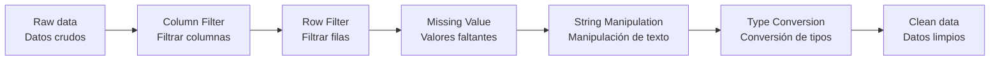

This pattern is not mandatory, but it is a useful order for beginners.

Este patrón no es obligatorio, pero es un orden útil para principiantes.

---

# 4. Data Analysis / Análisis de datos

## 4.1 From clean data to answers / De datos limpios a respuestas

Analysis starts after the data is reliable enough. The goal is not only to produce numbers, but to answer a question.

El análisis comienza cuando los datos ya son suficientemente confiables. El objetivo no es solo producir números, sino responder una pregunta.

Examples of HR questions:

Ejemplos de preguntas de HR:

- How many employees are in each department? / ¿Cuántos empleados hay en cada área?
- What is the average salary by department? / ¿Cuál es el salario promedio por área?
- Which department has the highest turnover? / ¿Qué área tiene mayor rotación?
- How is tenure distributed? / ¿Cómo se distribuye la antigüedad?

---

## 4.2 Joining tables / Unir tablas

In real data projects, information is often split across multiple tables. One table may contain employee names, another may contain salaries, and another may contain departments.

En proyectos reales de datos, la información suele estar dividida en varias tablas. Una tabla puede contener nombres de empleados, otra salarios y otra departamentos.

Example:

Ejemplo:

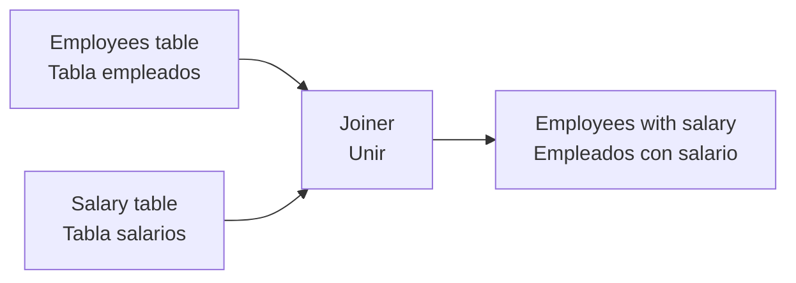

A join needs a common key. In HR data, this key could be `employee_id`.

Un join necesita una clave común. En datos de HR, esta clave podría ser `employee_id`.

---

## 4.3 Types of joins / Tipos de joins

For beginners, the most important join types are inner join and left join.

Para principiantes, los tipos de join más importantes son inner join y left join.

| Join type / Tipo de join | Meaning / Significado |
|---|---|
| Inner join | Keeps only matching records in both tables / Mantiene solo registros que coinciden en ambas tablas |
| Left join | Keeps all records from the left table and matching records from the right table / Mantiene todos los registros de la tabla izquierda y los coincidentes de la derecha |

Visual idea:

Idea visual:

```text
Inner join: only matches
Left join: all left records + matches when available

Inner join: solo coincidencias
Left join: todos los registros de la izquierda + coincidencias cuando existan
```

---

## 4.4 GroupBy / Agrupar

`GroupBy` is one of the most important nodes in KNIME for analysis. It summarizes data by one or more categories.

`GroupBy` es uno de los nodos más importantes de KNIME para análisis. Resume datos por una o más categorías.

Example question:

Pregunta de ejemplo:

```text
What is the average salary by department?
¿Cuál es el salario promedio por área?
```

Input table:

Tabla de entrada:

| department | salary |
|---|---:|
| HR | 4200 |
| HR | 4600 |
| IT | 6000 |
| IT | 6400 |

Output after GroupBy:

Salida después de GroupBy:

| department | average_salary |
|---|---:|
| HR | 4400 |
| IT | 6200 |

The logic is simple: choose the grouping column, then choose the calculation.

La lógica es simple: eliges la columna de agrupación y luego eliges el cálculo.

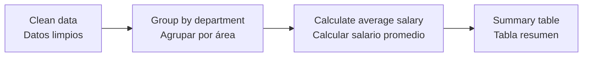

---

## 4.5 Common aggregations / Agregaciones comunes

Aggregations reduce many rows into fewer summary rows.

Las agregaciones reducen muchas filas a menos filas resumen.

| Aggregation / Agregación | Use / Uso |
|---|---|
| Count | Number of records / Número de registros |
| Sum | Total value / Valor total |
| Mean | Average value / Valor promedio |
| Median | Central value / Valor central |
| Minimum | Lowest value / Valor mínimo |
| Maximum | Highest value / Valor máximo |

A good analysis usually combines several aggregations.

Un buen análisis normalmente combina varias agregaciones.

---

## 4.6 Visualization / Visualización

Visualization helps communicate patterns. A chart should make the answer easier to understand, not just make the workflow look more advanced.

La visualización ayuda a comunicar patrones. Un gráfico debería hacer que la respuesta sea más fácil de entender, no solo hacer que el workflow parezca más avanzado.

Typical chart choices:

Opciones típicas de gráficos:

| Question / Pregunta | Chart / Gráfico |
|---|---|
| Compare categories / Comparar categorías | Bar chart / Gráfico de barras |
| Show distribution / Mostrar distribución | Histogram / Histograma |
| Show trend over time / Mostrar tendencia temporal | Line chart / Gráfico de líneas |
| Compare numeric spread / Comparar dispersión numérica | Box plot / Diagrama de caja |

---

## 4.7 Analysis workflow pattern / Patrón de workflow de análisis

A simple analysis workflow can follow this structure:

Un workflow simple de análisis puede seguir esta estructura:

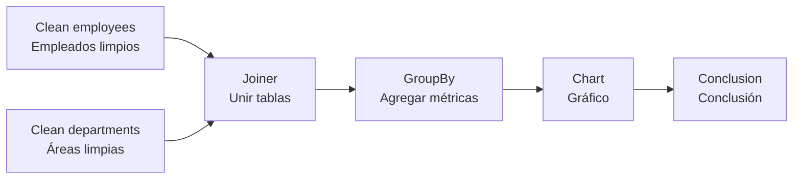

Notice that the conclusion is part of the analysis. A chart without interpretation is incomplete.

Observa que la conclusión hace parte del análisis. Un gráfico sin interpretación está incompleto.

---

# 5. Practical mini-case / Mini caso práctico

## 5.1 Business context / Contexto de negocio

The HR department wants a quick overview of employees by department. They have a file with employee data and want to understand headcount and average salary.

El área de HR quiere una vista rápida de empleados por área. Tiene un archivo con datos de empleados y quiere entender cantidad de empleados y salario promedio.

---

## 5.2 Expected workflow / Workflow esperado

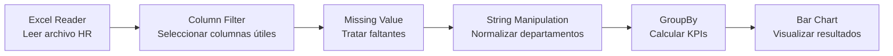

---

## 5.3 Example input / Entrada de ejemplo

| employee_id | name | department | salary |
|---:|---|---|---:|
| 1 | Ana | HR | 4200 |
| 2 | Luis | IT | 6200 |
| 3 | Marta | IT | 5900 |
| 4 | Juan | Finance | 5100 |

---

## 5.4 Example output / Salida de ejemplo

| department | employee_count | average_salary |
|---|---:|---:|
| Finance | 1 | 5100 |
| HR | 1 | 4200 |
| IT | 2 | 6050 |

---

## 5.5 Interpretation / Interpretación

The output shows that IT has the largest number of employees in this small example and also the highest average salary. This does not mean IT is always better paid in the full company; it only means that the current dataset shows that pattern.

La salida muestra que IT tiene la mayor cantidad de empleados en este ejemplo pequeño y también el salario promedio más alto. Esto no significa que IT siempre esté mejor pagado en toda la empresa; solo significa que el dataset actual muestra ese patrón.

---

# 6. Beginner mistakes / Errores comunes de principiantes

## 6.1 Trusting the chart too quickly / Confiar demasiado rápido en el gráfico

A chart is only as good as the data behind it. Always inspect the table before trusting the visualization.

Un gráfico es tan bueno como los datos que tiene detrás. Siempre inspecciona la tabla antes de confiar en la visualización.

---

## 6.2 Not checking data types / No revisar tipos de dato

If numbers are stored as text, calculations may fail or produce incorrect behavior. If dates are stored as text, time analysis becomes harder.

Si los números están almacenados como texto, los cálculos pueden fallar o comportarse de forma incorrecta. Si las fechas están almacenadas como texto, el análisis temporal se vuelve más difícil.

---

## 6.3 Overcomplicating the workflow / Complicar demasiado el workflow

A beginner workflow should be simple and readable. If you cannot explain what each node does, the workflow needs cleaning.

Un workflow de principiante debería ser simple y legible. Si no puedes explicar qué hace cada nodo, el workflow necesita limpieza.

---

## 6.4 Ignoring missing values / Ignorar valores faltantes

Missing values can change the result of averages, counts, and joins. Always inspect them before analysis.

Los valores faltantes pueden cambiar el resultado de promedios, conteos y joins. Siempre revísalos antes del análisis.

---

## 6.5 Not inspecting intermediate outputs / No inspeccionar salidas intermedias

A common mistake is building a long workflow and only checking the final result. If something is wrong in the middle, you will not know where the problem started. Use `Table View` nodes or right-click → "Open first out-port view" to check the output of each important node as you build.

Un error común es construir un workflow largo y solo revisar el resultado final. Si algo está mal en el medio, no sabrás dónde empezó el problema. Usa nodos `Table View` o clic derecho → "Open first out-port view" para revisar la salida de cada nodo importante mientras construyes.

---

## 6.6 Not reading the error message / No leer el mensaje de error

When a node turns red, the error message almost always tells you exactly what is wrong: a missing column, an incompatible type, a file not found. Beginners often try to guess the problem instead of reading the message first.

Cuando un nodo se pone rojo, el mensaje de error casi siempre dice exactamente qué está mal: una columna faltante, un tipo incompatible, un archivo no encontrado. Los principiantes muchas veces intentan adivinar el problema en lugar de leer el mensaje primero.

To read the error: right-click on the red node → "Open node message."

Para leer el error: clic derecho sobre el nodo rojo → "Open node message."

---

## 6.7 Building everything before testing / Construir todo antes de probar

Do not connect ten nodes before running any of them. Build and execute one or two nodes at a time. This way, if something fails, the cause is obvious.

No conectes diez nodos antes de ejecutar ninguno. Construye y ejecuta uno o dos nodos a la vez. Así, si algo falla, la causa es obvia.

---

# 7. Final summary / Resumen final

KNIME is a visual way to build data workflows. The central idea is simple: data enters the workflow, passes through nodes, and becomes a cleaned, transformed, and analyzed result.

KNIME es una forma visual de construir workflows de datos. La idea central es simple: los datos entran al workflow, pasan por nodos y se convierten en un resultado limpio, transformado y analizado.

The introductory course teaches four essential skills:

El curso introductorio enseña cuatro habilidades esenciales:

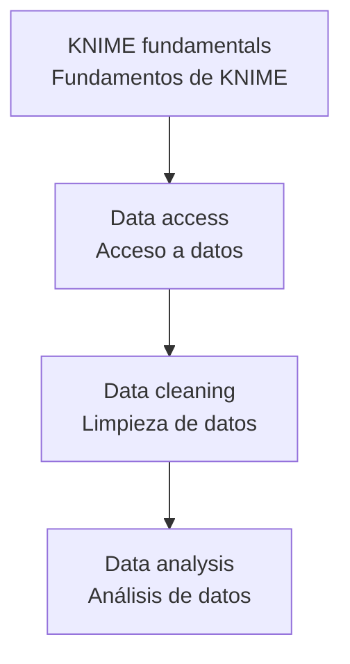

If you understand these four parts, you already understand the base of most KNIME workflows.

Si entiendes estas cuatro partes, ya entiendes la base de la mayoría de workflows en KNIME.

---

# 8. Quick reference / Referencia rápida

## Basic workflow pattern / Patrón básico de workflow

```text
Reader → Filter → Clean → Transform → Aggregate → Visualize
Lector → Filtrar → Limpiar → Transformar → Agregar → Visualizar
```

## Keyboard shortcuts / Atajos de teclado

| Action / Acción | Shortcut / Atajo |
|---|---|
| Execute selected node(s) / Ejecutar nodo(s) seleccionado(s) | `F7` |
| Execute all nodes / Ejecutar todos los nodos | `Shift + F7` |
| Open node configuration / Abrir configuración del nodo | `F6` or double-click / doble clic |
| Cancel execution / Cancelar ejecución | `F9` |
| Reset node / Reiniciar nodo | `F8` |
| Search nodes (node repository) / Buscar nodos | `Ctrl + Space` in the canvas |
| Zoom in / Acercar | `Ctrl + +` (or scroll up) |
| Zoom out / Alejar | `Ctrl + -` (or scroll down) |
| Fit workflow to screen / Ajustar a pantalla | `Ctrl + Shift + H` |

---

## Essential beginner nodes / Nodos esenciales para principiantes

| Category / Categoría | Nodes / Nodos |
|---|---|
| Data access / Acceso a datos | `CSV Reader`, `Excel Reader`, `File Reader` |
| Filtering / Filtrado | `Column Filter`, `Row Filter` |
| Cleaning / Limpieza | `Missing Value`, `String Manipulation` |
| Transformation / Transformación | `Column Expressions`, `Rule Engine` |
| Combining / Combinación | `Joiner`, `Concatenate` |
| Analysis / Análisis | `GroupBy` |
| Visualization / Visualización | `Bar Chart`, `Histogram`, `Line Plot`, `Box Plot` |

---

# 9. What to learn next / Qué aprender después

After this introductory course, the next topics should be:

Después de este curso introductorio, los siguientes temas deberían ser:

1. Flow variables / Variables de flujo  
2. Components / Componentes  
3. Loops / Bucles  
4. Advanced database workflows / Workflows avanzados con bases de datos  
5. Reporting and dashboards / Reportes y dashboards  
6. Automation / Automatización  
7. Machine learning workflows / Workflows de machine learning  
8. Deployment with KNIME Business Hub / Despliegue con KNIME Business Hub  

The goal of this first course is not to master KNIME. The goal is to think in workflows.

El objetivo de este primer curso no es dominar KNIME. El objetivo es aprender a pensar en workflows.
